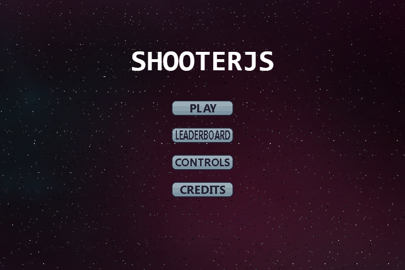

  

  
<h1 align="center">
  ShooterJS
</h1>

<h4 align="center">
  This is a simple space shooter built with Phaser.js.
</h4>

  

  
Additional description about the project and its features.

## Built With

- Phaser.js
- HTML & CSS
- Javascript

## Live Demo

[Live Demo Link](https://livedemo.com)

## Getting Started

**This is how you set up your project locally.**

To get a local copy up and running follow these simple example steps.

### Prerequisites

- Code editor.
- Node.js installed.

### Setup

### Install

### Usage

### Run tests

### Deployment

## 🤝 Contributing

Contributions, issues, and feature requests are welcome!

Feel free to check the [issues page](https://github.com/luisvinicius09/shooterJS/issues).

## Show your support

Give a ⭐️ if you like this project!

## Acknowledgments

- Hat tip to anyone whose code was used
- Inspiration
- etc

## 📝 License

This project is [MIT](lic.url) licensed.

<h2 align="center">
  Author(s)  
</h2>

  <strong>Author1 👤</strong>  

  GitHub: <a href="https://github.com/luisvinicius09">@luisvinicius09</a>

  LinkedIn: <a href="https://www.linkedin.com/in/luis-vinicius/">LinkedIn</a>

